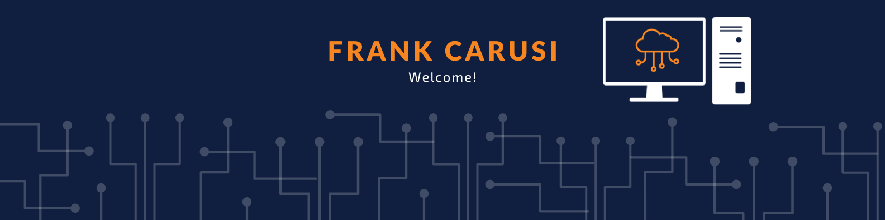

<!--

-->

### Hi there 👋

Welcome to my Page! My name is Frank Carusi and I am currently in my third year of the Honours Bachelor of Computer Science undergraduate degree at Sheridan College 🎓. I am specializing in Cloud Computing ☁️. I am also working as a research assistant at the Karmy Pain Clnic. I am passionate about building scalable and efficient Cloud solutions as well as furthing my own learning and personal growth. I have a great interest in exploring the latest in Cloud technologies and have found this constantly evolving field of study very reqrding to learn more about. Currently I am focusing my studies on learning AWS, Cloud Infrastructure, and Virtualization.

In my free time you can find me biking, playing basketball, or at a local comedy show.

Feel free to reach me at:

